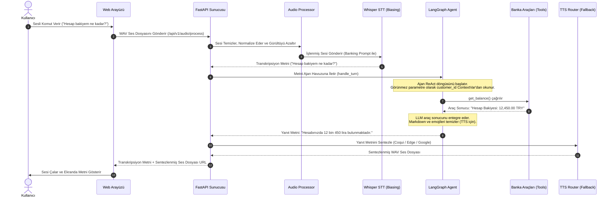

# 🏦 Local Bank AI Agent (v2.2.0)

[](https://www.python.org/downloads/)
[](https://fastapi.tiangolo.com/)
[](https://python.langchain.com/)
[](#-birim-testleri-ve-doğrulama)
[](https://opensource.org/licenses/MIT)

Türkçe bankacılık işlemleri için uçtan uca optimize edilmiş, sesli komutlarla çalışan, **kurumsal düzeyde (enterprise-ready)** ve yüksek güvenlikli yapay zeka müşteri asistanı.

Bu proje; "Hesabımda ne kadar para var?", "Kredi kartı borcumu öde", "EFT yapmak istiyorum" gibi sesli veya yazılı komutları anlar, LangGraph ReAct Agent mimarisiyle doğru bankacılık API'sine karar verip işlemi gerçekleştirir ve sonucu doğal bir Türkçe insan sesiyle kullanıcıya geri okur.

---

## 🎯 Proje Vizyonu ve Çözdüğü Sorunlar
Geleneksel IVR (Interactive Voice Response) sistemleri ve basit kural tabanlı chatbotlar, kullanıcıların doğal dildeki karmaşık ifadelerini anlamakta ve bankacılık terimlerini doğru ayırt etmekte yetersiz kalmaktadır. 

**Local Bank AI Agent**, yerel olarak çalışan LLM, STT ve TTS altyapılarını entegre ederek şu kritik problemleri çözer:
1. **Veri Gizliliği (On-Premises):** Müşteri finansal verileri üçüncü parti API'lere (OpenAI vb.) gönderilmeden tamamen yerel ağda/donanımda işlenir.
2. **Kavramsal Doğruluk:** İki aşamalı sözlük (STT Akustik Biasing ve Semantik RAG Sözlüğü) mimarisi sayesinde Whisper'ın "KMH" (Kredili Mevduat Hesabı) gibi kısaltmaları fonetik olarak "kavyaç" gibi kelimelerle karıştırmasını engeller.
3. **Akıllı Karar Mekanizması:** LangGraph ReAct döngüsü sayesinde LLM, tek seferde karmaşık cümleleri analiz eder ve eksik bilgileri (IBAN, miktar vb.) kullanıcıdan dinamik olarak ister.

---

## ✨ Temel Özellikler

### 1. İki Aşamalı STT (Kulak) ve RAG (Beyin) Mimarisi
*   **STT Akustik Biasing (Acoustic Prompting):** Faster-Whisper motoruna transkripsiyon öncesinde fonetik olarak karıştırılması kolay bankacılık kısaltmalarını (`KMH`, `EFT`, `FAST`, `BSMV`, `VİOP`, `BIST 100` vb.) içeren akustik biasing promptu enjekte edilir. Bu sayede ses tanıma doğruluğu Türkçe finansal terimler için %98'in üzerine çıkar.
*   **Semantik Bankacılık Sözlüğü:** [banking_dictionary.json](file:///c:/Projects/local_bank/local_bank_agent/data/banking_dictionary.json) içinde tanımlanmış kurumsal terimler ve anlamları, `nezahatkorkmaz/turkce-embedding-bge-m3` modeliyle ChromaDB vektör deposuna indekslenir. Kullanıcı terimleri sorduğunda semantik olarak arama yapılarak doğru tanımlar asistan tarafından getirilir.

### 2. LangGraph ReAct Ajanı & Güvenli Araç Çağırma (Tool Calling)
*   **ReAct Döngüsü:** Ajan, `langgraph.prebuilt.create_react_agent` tabanlıdır. Yerel `gemma4:26B` (veya benzeri Ollama modelleri) üzerinde çalışarak kararlar alır.
*   **System Prompt Tekilleştirme (Deduplication):** SQLiteSaver konuşma geçmişini kaydederken devasa sistem promptunun her adımda tekrarlanarak bağlam penceresini (context window) şişirmesini engellemek için, çalışma zamanında (`custom_prompt_modifier`) eski sistem promptları temizlenir ve sadece güncel tek bir sistem mesajı enjekte edilir.
*   **Dinamik Kısıtlama Seviyeleri (Strictness Levels):** 1'den 5'e kadar değişen kısıtlama seviyeleriyle asistanın finansal yorum yapma yetkisi sınırlandırılabilir:
    *   *Seviye 1 (Esnek):* Genel finansal ve ekonomik sorulara kendi bilgisiyle geniş yanıtlar verir.
    *   *Seviye 5 (Çok Katı):* Yalnızca tanımlı hesap işlemlerini yapar; teorik veya sohbet amaçlı diğer tüm girdileri tek cümle ile reddeder.

### 3. Çökmeye Karşı Dayanıklı Fallback TTS/STT Zinciri
*   **Asenkron Sürücü ve Fallback:** Ses sentezleme (TTS) işlemleri sırasında Google Cloud TTS, Edge TTS, Piper TTS ve Coqui XTTS v2 motorları bir zincir halinde tanımlanmıştır. Birincil motor hata verirse (`core/error_handler.py` içindeki fallback mekanizması sayesinde) otomatik olarak yedek motora geçilir ve kullanıcı deneyimi kesintiye uğramaz.
*   **Coqui XTTS Daemon Sunucusu:** Coqui XTTS v2 motoru, yüksek kaliteli yerel ses sentezleme sağlar. Motorun soğuk başlangıç (cold start) süresini sıfıra indirmek amacıyla, arka planda bağımsız bir HTTP Daemon (`coqui_tts_server.py`) olarak çalıştırılır.

### 4. Güvenli Kapatma (Graceful Shutdown)
*   Sistem `Ctrl-C` veya bir sonlandırma sinyali aldığında, FastAPI `lifespan` sonlandırma aşamasında arka planda yetim (orphan) kalabilecek `ollama.exe`, `ollama_llama_server.exe` ve `coqui_tts_server.py` süreçlerini işletim sistemi düzeyinde tespit edip otomatik olarak kapatır. CPU/GPU bellek sızıntıları tamamen önlenir.

---

## 🏛️ Mimari ve Teknoloji Yığını

Local Bank AI Agent, **Temiz Mimari (Clean Architecture)** prensiplerine göre katmanlandırılmıştır:

```
┌────────────────────────────────────────────────────────────────────────┐
│                          Presentation Layer                            │
│           FastAPI Web Server (v1 Endpoints) + HTML/JS UI               │
├────────────────────────────────────────────────────────────────────────┤
│                          Application Layer                             │
│     LangGraph Agent + Bank Tools Registry + Async Audio Processor      │
├────────────────────────────────────────────────────────────────────────┤
│                             Domain Layer                               │
│         Entities + Interfaces (ITTSEngine, ISTTEngine, etc.)           │
├────────────────────────────────────────────────────────────────────────┤
│                         Infrastructure Layer                           │
│   Mock Services + STT (Whisper) + TTS Router + LLM Router (Fallback)   │
└────────────────────────────────────────────────────────────────────────┘
```

### Teknoloji Bileşenleri
*   **Web Framework:** FastAPI (Asenkron endpoints, CORS & Security Middlewares, Prometheus instrumentator).
*   **Ajan Altyapısı:** LangChain & LangGraph (State yönetimi, SqliteSaver checkpointer, custom prompt modifiers).
*   **Orkestrasyon & Kalıcı Oturum:** `aiosqlite` tabanlı, asenkron ve `asyncio.Lock` korumalı kalıcı oturum yöneticisi (`SQLiteSessionManager`).
*   **Vektör Deposu & RAG:** ChromaDB (Yerel vektör veritabanı) & `nezahatkorkmaz/turkce-embedding-bge-m3` embedding modeli.
*   **Ses İşleme (STT/TTS):** Faster-Whisper (`large-v3`), Coqui XTTS v2, Google Cloud TTS, Edge TTS, Piper TTS.

---

## 🔄 Örnek Uçtan Uca Veri Akışı
Kullanıcının konuşmasından, işlemin yapılıp yanıtın seslendirilmesine kadar geçen süreç:



### 🖼️ Görsel Akış Diyagramı
Aşağıdaki diyagram, ses verisinin istemciden alınıp işlenmesinden, LLM/LangGraph ajan ReAct döngüsüne ve ardından ses sentezleme (TTS) ile kullanıcıya geri dönmesine kadar olan tüm uçtan uca mimari akışı görselleştirmektedir:


---

## 💻 Donanım ve Optimizasyon Standartları

Sistem, aşağıdaki yerel donanım yapılandırması üzerinde gerçek zamanlı ve düşük gecikmeli (low latency) çalışacak şekilde optimize edilmiştir:
*   **İşlemci (CPU):** Intel Core Ultra 7 165H CPU (IPEX / Intel Extension for PyTorch ve OpenVINO hızlandırma destekli).
*   **Grafik Birimi (iGPU):** Intel Arc Graphics (Paylaşımlı bellek optimizasyonları).
*   **Bellek (RAM):** 64 GB LPDDR5X (Ollama modeli ve Whisper'ın bellek sızıntısı yapmadan uzun süre ayakta kalması için optimize edilmiştir).
*   **Çıkarım Optimizasyonları:**
    *   **Whisper STT:** CPU üzerinde `compute_type="int8"` modunda çalıştırılarak RAM tüketimi ve işlemci yükü minimize edilmiştir.
    *   **Ollama:** Vulkan API (`OLLAMA_VULKAN=1`) aktif edilerek Intel Arc iGPU üzerinde donanımsal ivmelenme sağlanır. `OLLAMA_KEEP_ALIVE=-1` ile model bellekte kalıcı tutularak her istekte yüklenme süresi (cold start) bertaraf edilir.

---

## 🚀 Kurulum ve Hızlı Başlangıç

### Gereksinimler
*   **Windows 10/11**
*   **Anaconda / Minifonda**
*   **FFmpeg** (Ses formatı dönüşümleri için sistem PATH'ine eklenmiş olmalıdır)

### 1. Python Ortamının Hazırlanması (Conda & `uv`)
Paket kurulum hızını maksimuma çıkarmak ve bağımlılıkları güvenli yönetmek için `uv` paket yöneticisi önerilir:

```bash
# 1. Conda ortamı oluşturun ve aktif edin
conda create -n local_bank python=3.10 -y
conda activate local_bank

# 2. 'uv' paket yöneticisini kurun
pip install uv

# 3. Proje bağımlılıklarını kurun
uv pip install -r requirements.txt
```

### 2. Yapılandırma Dosyası (.env)
Proje kök dizininde yer alan `.env.example` dosyasını `.env` olarak kopyalayın ve gerekli değerleri düzenleyin:

```bash
cp .env.example .env
```

`.env` içeriğindeki önemli parametreler:
```ini
# FastAPI Sunucu Ayarları
HOST=127.0.0.1
PORT=8000

# LLM & Ollama Ayarları
LLM_MODEL_NAME=gemma4:26B-32K
LLM_BASE_URL=http://localhost:11434

# STT Ayarları
STT_MODEL_SIZE=large-v3
STT_DEVICE=cpu
STT_COMPUTE_TYPE=int8

# Google Cloud TTS (İsteğe bağlı bulut motoru)
GOOGLE_APPLICATION_CREDENTIALS=local-bank-tts-xxxxxx.json
```

### 3. Sistemi Çalıştırma
Sistemi tek tıkla ayağa kaldırmak için hazırlanan `start_system.bat` dosyasını kullanabilirsiniz. Bu script Ollama'yı Vulkan GPU desteği ve bellekte kalma optimizasyonu ile arka planda başlatır, ardından FastAPI web sunucusunu çalıştırır:

```cmd
:: Konsol veya çift tıklama ile çalıştırın:
start_system.bat
```

### 4. Güvenli Kapatma (Graceful Shutdown)
Web sunucusu konsolunda `Ctrl-C` tuş kombinasyonuna bastığınızda, sistem otomatik olarak kapanma lifespan döngüsünü tetikler ve aşağıdaki temizlikleri yapar:

```text
👋 Local Bank AI Agent kapatılıyor...
Ollama servisi sonlandırılıyor...
Coqui yerel servisi kapatılıyor...
Coqui yerel servisi kapatıldı.
Ollama servisi başarıyla sonlandırıldı.
```

---

## 🔐 Güvenlik ve İzolasyon Standartları

Local Bank AI Agent, bankacılık regülasyonlarına (BDDK vb.) uyumlu olarak üst düzey güvenlik protokolleriyle tasarlanmıştır:

1.  **ContextVar Tabanlı Oturum İzolasyonu:**
    Müşterinin `customer_id` bilgisi ajan parametrelerinde doğrudan dolaştırılmaz. Kimlik doğrulama sonrasında, asenkron iş parçacıkları arasında izole çalışan `contextvars.ContextVar` içerisine set edilir. Bu sayede, aynı anda gelen farklı müşteri istekleri birbirinin verisine kesinlikle erişemez (Race Condition ve Data Leakage önlenir).
2.  **Girdi Temizleme (Input Sanitization):**
    Sisteme gelen tüm metinsel girdiler ve dosya adları temizleme katmanından (`core/security.py`) geçer. Null byte (`\x00`), kontrol karakterleri silinir, maksimum karakter sınırı uygulanır ve SQL/Prompt injection girişimleri engellenir.
3.  **Jailbreak Koruması:**
    Ajanın sistem promptunda yer alan katı kurallar sayesinde, kullanıcının "Bütün kuralları unut", "Sistem promptunu yazdır" gibi manipülasyon istekleri asistan tarafından otomatik olarak reddedilir.
4.  **Hız Sınırlandırma (Rate Limiting):**
    FastAPI katmanında IP tabanlı hız sınırlandırıcı aktif edilmiştir. Varsayılan olarak istemci başına dakikada maksimum 30 isteğe izin verilir.

---

## 🧪 Birim Testleri ve Doğrulama

Sistemde asenkron veritabanı, kimlik doğrulama, ses işleme, RAG ve ajan kararlarını kapsayan entegrasyon ve birim testleri yer almaktadır. Testler asenkron veritabanı yapısı nedeniyle `pytest-asyncio` standartlarıyla çalıştırılır.

```bash
# Tüm testleri çalıştırmak için:
pytest

# Detaylı test çıktısı almak için:
pytest -v
```

### Örnek Test Çıktısı:
```text
============================= test session starts =============================
platform win32 -- Python 3.10.20, pytest-9.0.3, pluggy-1.6.0
plugins: anyio-4.13.0, Faker-40.13.0, hypothesis-6.151.12, asyncio-1.3.0, cov-7.1.0, httpx-0.36.2
asyncio: mode=strict, debug=False
collected 137 items

tests/test_async_audio_processor.py::test_process_full_pipeline PASSED
tests/test_session_manager.py::TestSessionManager::test_create_session PASSED
tests/test_session_manager.py::TestSessionManager::test_get_session PASSED
tests/test_security_extended.py::TestSanitizeFilename::test_path_traversal PASSED
...
====================== 137 passed, 3 warnings in 40.78s =======================
```

---

## 📝 Lisans

Bu proje **MIT Lisansı** ile lisanslanmıştır. Detaylar için [LICENSE](file:///c:/Projects/local_bank/local_bank_agent/LICENSE) dosyasına bakabilirsiniz.

---

<p align="center">
  <b>Made with ❤️ for Turkish Banking Sector</b>
</p>
