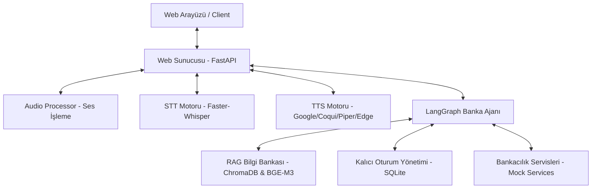
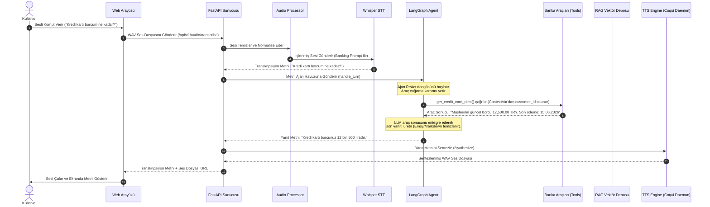

# Proje Mimari Dokümantasyonu (Local Bank Yapay Zeka Asistanı)

Bu doküman, Local Bank Yapay Zeka Müşteri Asistanı projesinin genel amacını, sistem mimarisini, modüller arası ilişkileri, veri akış şemalarını ve LangChain/LangGraph tabanlı ajan yapısını ayrıntılı bir şekilde açıklamaktadır.

---

## 🏛️ 1. Genel Amaç ve Modüler Mimari

Proje, banka müşterilerine sesli ve yazılı olarak vadesiz hesap sorgulama, kredi kartı borcu sorgulama, para transferleri (EFT/Havale), hesap listeleme ve kredi kartı borç ödeme gibi temel bankacılık operasyonlarını gerçekleştirebilecekleri, aynı zamanda bankacılık SSS (Sıkça Sorulan Sorular) ve terim sözlüğü konularında semantik arama yapabilecekleri yerel ve güvenli bir yapay zeka asistanı sunmayı hedefler.

Sistem, altı ana modülden oluşmaktadır:



### Modüllerin Görevleri:
1.  **Web Sunucusu (`web_server.py` & `routes/`):** FastAPI tabanlı sunucudur. İstemciden (tarayıcı) gelen REST isteklerini karşılar, kimlik doğrulama middleware'ini çalıştırır, oturum yönetimini koordine eder ve lifespan döngüsünde TTS sunucusu ile RAG veritabanını başlatır.
2.  **Ses İşleme Servisi (`services/audio_processor.py`):** İstemciden gelen WAV formatındaki ses verisini normalize eder, gürültü azaltma (noise reduction) uygular, ses seviyelerini düzenler ve STT motorunun en yüksek verimle çalışması için ses dosyasını hazırlar.
3.  **STT (Speech-to-Text) Motoru (`infrastructure/stt_engine.py`):** `Faster-Whisper` kütüphanesini kullanarak ses kayıtlarını metne dönüştürür. `initial_prompt` (banking biasing) mekanizması ile "KMH", "EFT", "FAST" gibi sektörel kısaltmaların fonetik olarak doğru transkribe edilmesini sağlar.
4.  **TTS (Text-to-Speech) Motoru (`infrastructure/tts_engine.py` & `coqui_tts_server.py`):** Metinsel yanıtları ses dosyasına dönüştürür. Google Cloud TTS (Bulut), Edge TTS (Çevrimiçi ücretsiz), Piper (Hafif yerel) ve Coqui XTTS v2 (Yüksek kaliteli yerel) motorlarını arayüz tabanlı (`ITTSEngine`) ve yedekli zincir (fallback chain) mimarisinde barındırır. Herhangi bir motorun sentezleme anındaki çökmelerini önlemek için `core/error_handler.py` içinde akıllı yedekleme mekanizması (`execute_with_fallback`) tanımlanmıştır. Coqui motoru, soğuk başlangıç (cold start) süresini engellemek için kalıcı bir HTTP Daemon (sunucu) olarak arka planda çalıştırılır.
5.  **LangGraph Banka Ajanı (`application/langchain_agent.py` & `application/tools_registry.py`):** Sistemin karar verici beynidir. Kullanıcı girdilerini yorumlar, hangi aracı (tool) hangi parametrelerle çağıracağını ReAct döngüsünde belirler ve sistem kurallarına (strictness level) göre yanıtı üretir.
6.  **RAG Bilgi Bankası (`infrastructure/knowledge_base.py`):** `nezahatkorkmaz/turkce-embedding-bge-m3` modeli ve `ChromaDB` vektör veritabanını kullanarak, bankacılık SSS verilerini (`bank_kb.json`) ve terimler sözlüğünü (`banking_dictionary.json`) indeksler ve semantik arama yapılabilmesini sağlar.
7.  **Kalıcı Oturum Yönetimi (`core/session_manager_persistent.py`):** Oturum bilgilerini, kullanıcı kimlik doğrulamalarını ve konuşma bağlamlarını `aiosqlite` kullanarak tamamen asenkron olarak SQLite üzerinde saklar. Eşzamanlı isteklerde veritabanı kilitlenmelerini (`database is locked`) önlemek için `asyncio.Lock` mekanizmasıyla thread ve coroutine güvenliği sağlanmıştır.

---

## 🔄 2. Örnek Veri Akış Şeması

Kullanıcının mikrofona konuşmasından, aracın çalışıp TTS'in sentezlenmiş sesi çalmasına kadar geçen uçtan uca akış şu şekildedir:



---

## 🔗 3. LangChain ve LangGraph Derinlemesine Analizi

Projenin yapay zeka ajan mimarisi, LangChain ve LangGraph kütüphanelerinin modern entegrasyonu üzerine kurulmuştur.

### 1. ReAct Ajan Döngüsü ve Yapısı
Ajan, `langgraph.prebuilt.create_react_agent` fonksiyonu kullanılarak kurulmuştur. Ajanın beyni olarak `ChatOllama` sınıfı üzerinden yerel `gemma4:26B` veya benzeri Ollama modelleri kullanılır.
Ajan döngüsü, bir mesaj listesini (`messages`) girdi olarak alır ve şu ReAct (Reasoning and Acting) adımlarını yürütür:
*   **Düşünme (Reason):** LLM, sistem promptu ve mesaj geçmişini inceleyerek kullanıcının niyetini analiz eder.
*   **Eylem (Act):** Eğer bir bankacılık işlemi veya bilgi bankası sorgusu gerekiyorsa, LLM çıktı olarak ilgili aracı (tool) ve parametrelerini çağıracak bir `tool_calls` mesajı üretir.
*   **Araç Çalıştırma (Tool Execution):** LangGraph altyapısı, çağrılan aracı python tarafında çalıştırır ve sonucunu bir `ToolMessage` olarak mesaj listesine ekler.
*   **Sonuç Üretimi:** LLM, araçtan gelen sonucu okuyarak kullanıcıya sunulacak doğal dildeki yanıtı üretir.

### 2. State Yönetimi ve Kalıcı Konuşma Hafızası (Memory & Checkpointer)
Konuşma geçmişi, HTTP istekleri arasında kaybolmaması için LangGraph'in checkpointer mekanizmasıyla yönetilir:
*   **SQLite Entegrasyonu (`SqliteSaver`):** `application/langchain_agent.py` içindeki `_build_memory()` metodu, `./agent_memory.db` dosyasına bağlanan bir `SqliteSaver` oluşturur.
*   **Thread İzolasyonu:** Her konuşma oturumu bir `thread_id` (FastAPI `session_id` değeriyle eşleştirilir) üzerinden takip edilir. Ajan çalıştırılırken `config={"configurable": {"thread_id": session_id}}` parametresi verilerek sadece o oturuma ait mesaj geçmişinin yüklenmesi sağlanır.

### 3. Prompt Tekilleştirme ve Dinamik Kısıtlama Seviyeleri (System Prompt Deduplication)
*   **Problem:** SQLiteSaver konuşma geçmişini korurken, devasa sistem promptunun (kurallar listesi) her insan etkileşiminde geçmişe eklenmesi bağlam penceresinin (context window) dolmasına ve yerel çıkarım sürelerinin uzamasına yol açıyordu.
*   **Çözüm (`custom_prompt_modifier`):** Ajan başlatılırken `prompt` parametresine özel bir state değiştirici metot atanmıştır:
    ```python
    def custom_prompt_modifier(state):
        cleaned_messages = [msg for msg in state["messages"] if msg.type != "system"]
        lvl = _current_strictness_level.get()
        dynamic_prompt = get_dynamic_prompt(lvl)
        return [SystemMessage(content=dynamic_prompt)] + cleaned_messages
    ```
    Bu fonksiyon, veri tabanında saklanan geçmiş sistem mesajlarını temizler ve LLM'e gitmeden hemen önce o anki kısıtlama seviyesine (strictness level 1-5) göre oluşturulmuş güncel ve tek bir `SystemMessage` ekler.

### 4. Güvenli Araç Entegrasyonu (Tool Calling & ContextVar Security)
Prompt Injection (istem enjeksiyonu) saldırılarını engellemek ve çoklu kullanıcı ortamında güvenliği sağlamak için özel bir mimari uygulanmıştır:
*   **Görünmez Parametreler:** `BankToolsRegistry` içindeki bankacılık araçlarında (bakiye sorgulama, EFT/Havale vb.) `customer_id` veya `account_number` gibi hassas kimlik bilgileri parametre olarak tanımlanmamıştır. Bu sayede LLM, aracı çağırırken başka bir müşterinin hesap numarasını enjekte edemez.
*   **ContextVar Güvencesi:** Kullanıcının kimliği doğrulandıktan sonra, `customer_id` değeri `contextvars.ContextVar` olan `_current_customer_id` değişkenine set edilir. Araçlar çalıştırıldığında bu `ContextVar` değerini okuyarak işlemi gerçekleştirir. Bu yapı thread-safe olup asenkron görevler arasında izole edilmiştir.
